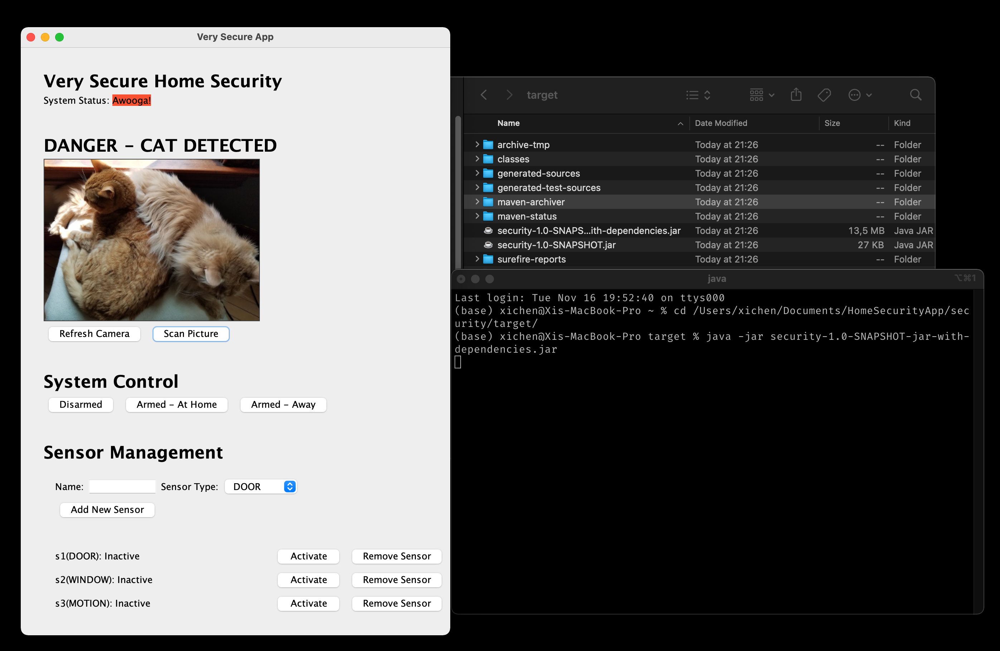

# Home Security App

This is home security application which can read sensor and camera input and enable/disable alarm accordingly. It is developed and tested on MacOS 12.0.1 with Oracle JDK 17.0.1.

## Cloning

```
git clone https://github.com/xichen-de/HomeSecurityApp.git
```

## Build and test

Use Maven to compile and run the unit tests:

```
mvn compile
mvn test
```

## Build JAR package

```
mvn install
```

## Run

```
java -jar security-1.0-SNAPSHOT-jar-with-dependencies.jar
```



## Requirements

1. If alarm is armed *and* a sensor becomes activated, put the system into pending alarm status.
2. If alarm is armed *and* a sensor becomes activated *and* the system is already pending alarm, set the alarm status to alarm.
3. If pending alarm *and* all sensors are inactive, return to no alarm state.
4. If alarm is active, change in sensor state should not affect the alarm state.
5. If a sensor is activated *while* already active *and* the system is in pending state, change it to alarm state.
6. If a sensor is deactivated *while* already inactive, make no changes to the alarm state.
7. If the image service identifies an image containing a cat *while* the system is armed-home, put the system into alarm status.
8. If the image service identifies an image that does not contain a cat, change the status to no alarm *as long as* the sensors are not active.
9. If the system is disarmed, set the status to no alarm.
10. If the system is armed, reset all sensors to inactive.
11. If the system is armed-home *while* the camera shows a cat, set the alarm status to alarm.